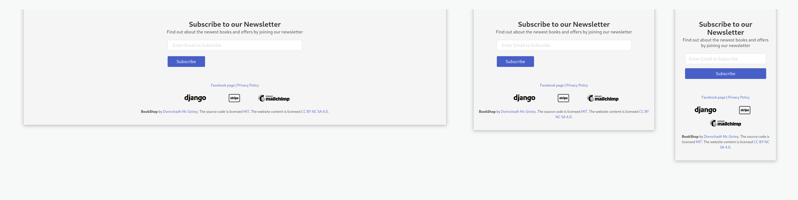

# Project 5 - BookShop


## The Links

[Link to site](https://web-production-7efa.up.railway.app/)
[Link to github project](https://github.com/dmcginley/shop_project)
[Facebook page](https://www.facebook.com/profile.php?id=100088574147985)

# Table of contents

- [Project 5 - BookShop](#project-5---bookshop)

  - [Table of contents](#table-of-contents)
  - [The Links](#the-links)
  - [About the Project](#about-the-project)
  - [Who is this website for](#who-is-this-website-for)
  - [E-commerce](#e-commerce)
  - [Wireframe](#wireframe)
    - [UX design](#ux-design)
  - [Facebook Page](#facebook-page)
  - [Agile development - kanban board](#agile-development---kanban-board)
  - [Epic](#epic)
  - [User Stories](#user-stories)
    - [Admin](#admin)
    - [User](#user)
    - [Customer](#customer)
    - [Registered customer](#registered-customer)
  - [Technologies Used](#technologies-used)
    - [The Code](#the-code)
    - [Main libraries & applications used](#main-libraries--applications-used)
  - [Features](#features)
  - [Site Layout](#site-layout)
  - [Accessibility](#accessibility)
  - [Testing](#testing)
    - [Validator Testing](#validator-testing)
    - [Errors](#errors)
    - [User tests](#user-tests)
  - [Error Handling](#error-handling)
  - [Troubleshooting](#troubleshooting)
  - [Deployment](#deployment)
    - [prerequisite for deployment](#prerequisite-for-deployment)
    - [Deploying](#deploying)
  - [Version Control](#version-control)
    - [How To Clone The Project](#how-to-clone-the-project)
  - [Resources](#resources)
    - [Django](#django)
    - [Python](#python)
  - [Credits](#credits)

    - [HTML, CSS, Images & Icons](#html-css-images--icons)
    - [Bulma](#bulma)
    - [Django & Python](#django--python)

    &nbsp;

## About the Project

An online e-commerce book Shop featuring some of the most well-known book.
In the store, you can go from searching for a book to reading a description about it to checking out in one flowing movement through.

It has a simple to understand clean design while being based on the standard for e-commerce book sites out there e.g. Amazon or Book Depository.

## Who is this website for

The site is for people searching for books who like a hassle-free experience while shopping.
People who would rely on searching books by title or author, not just by ISBN.

## E-commerce

As an e-commerce bookstore this is a b2c focused platform.

The website would relay on the sale of books primarily as shipping these products can be quite cheap.

With the ability for customers to login and edit and view their profile, or their order history, allows for customers to return to the site.
We also have a newsletter for people to sign up too. The newsletter section which is present on each page as a gentle reminder if they haven't signed up that they can do so at any time.
The idea with the newsletter is that we would offer discounts, early access two new titles and other promotions.

## Wireframe

Created in Figma

#### UX design

With the UX design I have gone for a muted color palette, so the books stand out and off white background so it is not too glaring on the eyes.
The general flow of a bookstore or e-commerce book website is fairly well known, so I have not strayed too far from these principles.
From viewing a book to added it to your cart, and from there you can checkout straight away.
The user experience is designed to be streamlined and without barriers or elements on the page to put you off your shopping experience.
I've gone for a classical modernist design to invoke the feeling that you would get usually in a bookshop or library, the use of whitespace is important for keeping the focus on the books while the site itself is just the shelves that the books sit on.

###### _link to file:_ [https://www.figma.com/file/j25NLKtS...](https://www.figma.com/file/j25NLKtS1bbWLyaCnHOa8U/Untitled?node-id=0%3A1)


## Facebook Page

This is the second attempt of a page created as my first account was deleted by face book, so I added a screenshot here incase the link doesn't work

[Facebook BookShop Page](https://www.facebook.com/profile.php?id=100088733114158)


## Agile development - kanban board


## Epic

Create an E-commerce Book shop that can have multiple users either signed in or not. They can search for books and add them to the cart easily and fluidly that allows for quick shopping.

## User Stories

#### Admin

- "As an admin, I want to be able to edit or delete a book from the main page or detailed page so it takes as little time as possible."

  Acceptance criteria:

  1. Given that I'm an admin when I click on the edit button below the book I get taken to a page where I can edit details on the book.
  2. Given that I'm an admin when I click on the delete button below the book gets deleted from the shop.
     &nbsp;

- "As an admin I want to be able to add a book to the shop from the main website."

  Acceptance criteria:

  1. Given that I'm an admin when I navigate to the profile dropdown I can see the link for add a book, when I click the link it takes me to the page where I can then add the book.

#### User

- "As a user, I want to be able to view each book in detail so I can see more information about the book."

  Acceptance criteria:

  1.  Given that I'm a user when I click on a book from the main page I am taken to the detail page of that book with further information and a description of that book.
      &nbsp;

- "As a user I want to be able to search by genre of books so I can search by my favourite genre and types."

  Acceptance criteria:

  1. Given that I'm a user when I navigate to the navigation bar and click on the genres dropdown, I can see a list of genres to select from. When I click on one of the links I am then taken to that genre page.
     &nbsp;

- "As a user I want to be able to search for a book by author, title, or by ISBN as with most sites, so that I can search in many different ways.

  Acceptance criteria:

  1. Given that I'm a user, when I my enter details to the search bar and hit enter it returns the search queries if the search is a valid search term.

  2. Given that I'm a user, when I enter no search terms it returns an error with a text prompt showing up on the screen prompting me to enter a search (by title, author name, or ISBN ).

  3. Given that I'm a user, when I enter a title that is too short I am prompted that the site didn't find anything for that search term entered.
     &nbsp;

- "As a user, I'd like to only have a few books per page so I don't have to be constantly scrolling through a large list of books.

  Acceptance criteria:

  1.  Given that I'm a user when I scroll to the bottom of the page I see a set of page numbers that I can easily navigate through pages or from the very first page to the very last.

#### Customer

- "As a customer, I want to be able to see feedback messages so I can see if I have placed an order successfully or not, or preformed a task correctly."

  Acceptance criteria:

  1. Given that I'm a customer when I add a book to my cart a message shows up in the corner with the cart detail showing that I have added the book to my cart.

  2. Given that I'm a customer when updating my number of books from
     the cart page a success message shows up in the top right-hand corner.
     &nbsp;

Acceptance criteria:

- "As a customer I like to be able to add or delete the quantity of books for my cart in case I change my mind midway through purchasing items."

  Acceptance criteria:

  1. Given that I'm a customer, when I navigate to the cart, under the price of the book I can either increase or reduce the quality of books in my cart.

  2. Given that I'm a customer when I navigate to the cart, I can remove books completely from my cart.
     &nbsp;

- "As a customer when I purchase over certain amount of books, I wish to be offered free delivery so that it gives me incentive to purchase over a certain amount."

  Acceptance criteria:

  1. Given that I'm a customer, when I add a book to the cart, in pop-up there is text at the bottom showing me how much I have to spend to receive free delivery.

  2. Given that I'm a customer, when I spend more than €40, the cart dropdown pop-up shows that I can avail of free delivery.

#### Registered customer

- "As a registered customer, I want to be able to edit my profile address so I don't have to be typing it in each time I purchase an item."

  Acceptance criteria:

  1. Given that I'm a registered customer when I navigate to my profile page I see a form where I can fill out my address details.
     &nbsp;

- "As a registered customer I want to be able to view my order history so that I can remember which books I purchased from the shop and at what prices."

  Acceptance criteria:

  1.  Given that I'm a registered user when I navigate to my profile page I can see a list of my orders, when I click on one of the order numbers, it then takes me to the order summary page where can see details about that order.

## Technologies Used

- [Visual Studio Code](https://code.visualstudio.com/) IDE I used for Bootstrap, JavaScript, & Django
- [Amazon Web Services (AWS)](https://aws.amazon.com/) - for hosting the static files
- [Railway](https://railway.app/) for deploying the site

- [GitHub](https://github.com/) - the version control
- [SQLite](https://www.sqlite.org/index.html) - database used in development
- [PostgreSQL](https://www.postgresql.org/) - database for production -[mailchimp](https://mailchimp.com/landers/newsletters/?gclid=CjwKCAiA-dCcBhBQEiwAeWidtdvhJHs73l99kKDOGyTZcQ7NGVbrA0WUOZjT8kMVtaNnxWCQkgjshBoC-oIQAvD_BwE&gclsrc=aw.ds) - for the Newsletter

### The Code

- [Bulma](https://bulma.io/) - CSS framework that
- [jQuery](https://jquery.com/)
- [Django 4.1.2](https://www.djangoproject.com/)
- [Python3](https://www.python.org/)

### Main libraries & applications used

- [django-allauth](https://django-allauth.readthedocs.io/en/latest/overview.html)
- [django-crispy-forms](https://django-crispy-forms.readthedocs.io/en/latest/)
- [crispy-bulma](https://github.com/ckrybus/crispy-bulma)
- [django-countries](https://pypi.org/project/django-countries/)
- [stripe](https://stripe.com/en-ie) - payments infrastructure

## Features

1. Create an account & change profile address and view past orders.
2. Search by Genre, Author (either name), or ISBN
3. Add a book to the cart from the homepage
4. Click on a book cover to be taken to the detail page of the book
5. Increase or reduce the quality of course you wish to cover
6. Purchase from the book detail page
7. View a description of the book Home Depot detail page along with
8. View a short summary of the books to be purchased on the checkout page
9. Free delivery over a certain amount (€40), this is calculated by the back-end.
10. Pagination on the home page, genre page and book by price page
11. Purchase books with a credit card or debit card using stripe

## Site Layout

###### The general look and feel of the shop


Navbar - I included the banner also as it's part of the visual aesthetic


Footer - a simple clean footer with a Newsletter section above it


Pagination


The book detail page as would be see on 3 sizes of devices

## Accessibility

- Clean minimal design with the use of white space and small use of strong colors for text and links so it is clear to see where to go and what to do as some book sites can be over cluttered
- Contrasting colors e.g. a lighter buttons on the dark background with white text color on the Hero section of the home page
- alternative text on images, buttons, and < a > tags, where appropriate.
  The navigation bar and all elements on the pages are tab friendly, mostly through the use of Bulma.

## Testing

### Validator Testing

All CSS passed with no errors, only a few warning because of vendor extension e.g.

- **-webkit-border-radius is a vendor extension**
- **-moz-border-radius is a vendor extension**


- **lighthouse**

### Errors

All but a few lines in the python files passed the PEP8 online - (line length set at 79 ch) In settings.py the first NAME of the some in the settings.py I left longer, and in the webhook_handler I left longer so not to break the code as I still havening slight errors with it.

There is an error sometime when placing an order the order number that gets emailed out is incorrect.

### User tests

**Login**

- Go to the Sign In page
- Enter your username or email, & your password
- Press the Sign In button after which you will be redirected to the home page, with a success message showing in the top right corner telling you you have successfully signed in.

**Create an account**

- Go to the register page
- Enter required details e.g. email, email again, username, password, and password again, and press the button "create your account"
- You'll be redirected to the login page so that you'll be able to login to your new account

**Add an item to cart**

- Navigate to The Book you wish to purchase
- Click on the add to cart button, the cart dropdown will show on the top right hand corner
- Showing the title of the books that you added to the cart, and a short summary of the items in your cart
- Below this will be the total price and a button to allow you to check out immediately if you wish

**Check order history**

- If you're not logged in login in and go up to the right-hand corner or the menu with dropdown and you can click on profile
- On the profile page you will see the order history in the right column, click on one of your past orders
- This will take you to the orders history page, there you'll see a details of the order that was placed and to the right of that the
- items That were purchased

**Searching by genre**

- Go to the navigation bar and click on the genres dark down

- when you click on the dropdown you will see a list of genres of books

- click on one of them and then you will be taken to the page with all the books from that genre

## Error Handling

- Created 400, 403, 404 500 error pages

- Catching errors and returning messages of the error

- Catching errors in the search form for text, and number input (ISBN)

- Returning, redirecting the user to the home page or login page where required, if the user isn't allowed to that section of the site.

## Troubleshooting

**webhook_handler** error, couldn't locate the issue with:

- missing code in minor indentation errors in the strip_elements.js file, sorted by going over the code again, testing and running print() statements

```
    if order:
            print("order_number is", order.order_number)
        else:
            print("order not found")
```

- generated print() statements through the project to catch spelling errors, or code that wasn't being run or overlooked issues with the code e.g. Two different order numbers were being sent one for the success page and order history, and a different order number to the users email.

```
            print(
                f"CONFIRMATION EMAIL after FINDING order {order.order_number}")
```

working out what the order number was doing.

- missing "clientSecret"
- forgot fields in models

```

- Fixed an error in the clientSecret that was giving a 500 error on the stripe webpage when checking that the payment was working successfully.

var postData = {
        ...
        'client_secret': clientSecret,
        ...
    };
```

## Deployment

#### prerequisite for deployment

#### Deploying

**Step 1.**

```
$ pip install gunicorn
```

**Step 2.**

```
$ pip freeze
$ pip freeze > requirements
```

**Step 3.**
Create a Procfile in your root folder and save the following lines of codes in it
web: gunicorn 'name-of-application.wsgi'
Note: A Procfile has no file extension

**Step 4.**
Create runtime.txt

**Step 5.**
Adjust the settings.py file in the django app

- Look for the line that has

  ALLOWED_HOST = [ ]

  and change it to

  ALLOWED_HOST = ['*']

**Step 6.**
Push to Github

In railway website Click + New

- Select GitHub Repo, and then select which repo you wish to work from
- In Settings tab, under domain click generate domain
- A link to your deployed app is naw created.

For my app I make sure to set RAILWAY_DEPLOYMENT=True to push all necessary files and folders to AWS.

From Visual Studio Code terminal

```
$ export RAILWAY_DEPLOYMENT=True
$ python manage.py collectstatic
```

## Version Control

The version control is done using Git through [GitHub](https://github.com/).

### How To Clone The Project

1. From the repository, https://github.com/dmcginley/shop_project navigate to ** <> Code** button, and in the dropdown menu select the URL: (https://github.com/dmcginley/shop_project.git).

2. Open a Terminal on your computer.

3. Type git clone, and then paste the URL you copied earlier.

4. Press Enter to create your local clone.

## Resources

**General reading and resources.**

- [How to Write Good Commit Messages: A Practical Git Guide](https://www.freecodecamp.org/news/writing-good-commit-messages-a-practical-guide/)

- [The Devops Handbook](https://www.goodreads.com/book/show/26083308-the-devops-handbook?from_search=true&from_srp=true&qid=LbEb3qbNpR&rank=1) - How to Create World-Class Agility, Reliability, & Security in Technology Organizations
- [web.dev](https://web.dev/) - up to date information on web development

#### Django

- [Django documentation](https://docs.djangoproject.com/en/4.0/)

#### Python

- [Real Python](https://realpython.com/)

## Credits

**Sites content, media, and help with implementing code from tutorials & online help.**

#### HTML, CSS, Images & Icons

- [Boxicons](https://boxicons.com/?query=search)
- [Css gradient](https://cssgradient.io/)- used for gradient on the search icon
- [How To Shorten Text With CSS (ellipsis)](https://www.youtube.com/watch?v=lurEwLtdWMI)

- [XML-Sitemaps](https://www.xml-sitemaps.com/) - for generating the sitemap -[What is a robots.txt file?](https://moz.com/learn/seo/robotstxt)

#### Bulma

- [Bulma - Column sizes](https://bulma.io/documentation/columns/sizes/)
- [BUG FIX: columns.is-variable overflow #1540](https://github.com/jgthms/bulma/issues/1540)
- [Build a Django Front End With Bulma – Part 2](https://realpython.com/django-social-front-end-2/)
- [Bulma Pagination Styles](https://www.geeksforgeeks.org/bulma-pagination-styles/)

#### Django & Python

- [Layouts, Fundamentals of crispy-forms](https://django-crispy-forms.readthedocs.io/en/latest/layouts.html)
- [stack**overflow**](https://stackoverflow.com/questions/61609953/is-there-a-way-to-hide-a-button-on-every-page-except-home-page-of-a-site-in-djan) - hiding button on every page except Home page in Django
- [How to Implement Pagination in Django With Function-Based Views](https://python.plainenglish.io/how-to-implement-pagination-in-django-with-function-based-views-8f6462554930)
- [Chapter 10: Advanced Models](https://django-book.readthedocs.io/en/latest/chapter10.html) - help for creating the book model and related models
- [Querying full name in Django](https://stackoverflow.com/questions/7681708/querying-full-name-in-django)
- [How to add a robots.txt to your Django site](https://adamj.eu/tech/2020/02/10/robots-txt/) - keeps the robots.txt file in a template and renders it at the URL.
- [Django-filter, how to make multiple fields search? (with django-filter!)](https://stackoverflow.com/questions/57270470/django-filter-how-to-make-multiple-fields-search-with-django-filter)

- [stripe Docs](https://stripe.com/docs)

- [CodeInstitute (Project - Boutique Ado)](https://learn.codeinstitute.net/courses/course-v1:CodeInstitute+EA101+2021_T1/courseware/eb05f06e62c64ac89823cc956fcd8191/48ac02aa8ecc4079be016c336231bee7/)
- [Project - Boutique Ado (Stripe Part 14)](https://learn.codeinstitute.net/courses/course-v1:CodeInstitute+EA101+2021_T1/courseware/eb05f06e62c64ac89823cc956fcd8191/48ac02aa8ecc4079be016c336231bee7/) - save info and how to integrate stripe payment to a site
